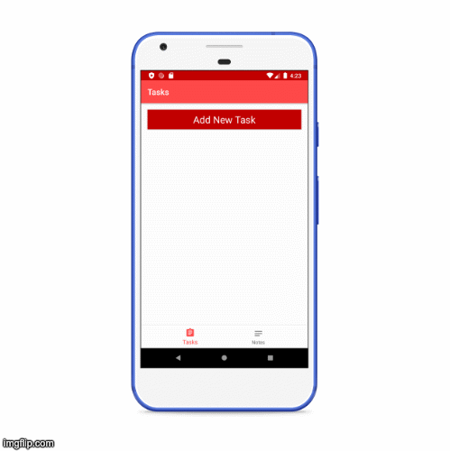

# Todo Notes Application Kotlin Android

Built a complex, scalable, modular Notes Application using MVVM Architecture and AndroidX Libraries. The application uses Room, SQLite, LiveData to store and sync notes. The application uses Coroutine calls with Toothpick dependency injection. Display using Fragments with JetPack Navigation, RecyclerView with adapterView, customViews.

## Project characteristics 
--------------------

* [Kotlin](https://kotlinlang.org/)
* Architecture Design (Model-View-ViewModel)
* [Android Jetpack](https://developer.android.com/jetpack)
* Single-activity architecture, using the [Navigation component](https://developer.android.com/guide/navigation/navigation-getting-started)
* Dependency Injection (Toothpick)
* Material Design 

## Built with
-------------

* [Kotlin](https://kotlinlang.org/) - Android mobile development has been Kotlin-first since Google I/O in 2019.
* [Coroutines](https://kotlinlang.org/docs/reference/coroutines-overview.html) - Asynchronous or non-blocking programming
* [Android Architecture Components](https://developer.android.com/topic/libraries/architecture) MVVM stands for Model, View, ViewModel.
* [LiveData](https://developer.android.com/topic/libraries/architecture/livedata) - Data objects that notify views when the underlying data changes
*[Navigation Component](https://developer.android.com/guide/navigation) - Allows interactions to navigate across, into, and back out from the different pieces of content in the applcation
 * [Room](https://developer.android.com/topic/libraries/architecture/room) - SQLite object mapping library
 * [Toothpick Dependency Injection](https://academy.realm.io/posts/droidcon-boston-daniel-molinero-toothpick-dependency-injection-android/)Toothpick is a scope tree based, runtime with a special focus on Android 
* [DataBinding](https://developer.android.com/topic/libraries/data-binding) - The Data Binding Library is a support library that allows you to bind UI components in your layouts to data sources

 
 

 

